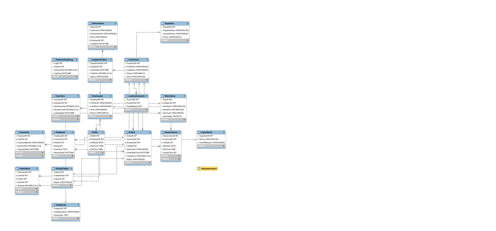

# Set Al Sham Restaurant Management System

A comprehensive PHP and MySQL-based web application designed for a restaurant. The project includes a customer-facing portal and a full-featured administrative dashboard.

## Project Structure

The repository is organized into three main directories:

- **`/admin`**: The backend administrative dashboard. It includes user authentication, role management, and configuration tables to manage the restaurant's operations.
- **`/customer`**: The frontend portal for customers. This includes features like placing orders (`cart.php`), booking tables (`reserve.php`), and submitting feedback (`feedback.php`).
- **`/database`**: Contains all the necessary SQL scripts to set up the database. Includes the schema, sample data, advanced queries, stored procedures, triggers, and authorization scripts.

## Features

* **Customer Portal**: Browse the menu, add items to a cart, make reservations, and provide feedback.
* **Admin Dashboard**: Secure login for staff and administrators to manage restaurant data, view orders, and manage roles.
* **Database**: Robust relational database design with sample data, built-in procedures, and triggers to handle business logic at the database level.

  

## Setup Instructions

1. **Database Setup**:
   - Create a new MySQL database for the project.
   - Execute the SQL scripts located in the `/database` folder in the following order:
     1. `SetAlSham_Schema.sql`
     2. `SetAlSham_ProceduresTriggers.sql`
     3. `SetAlSham_SampleData.sql`
     4. `SetAlSham_AdminUsers.sql`
     5. `SetAlSham_Authorization.sql`
     6. `SetAlSham_AdvancedQueries.sql` (Optional, for analytics)

2. **Configuration**:
   - Open `/admin/db.php` and `/customer/db.php` and update the database connection credentials (hostname, username, password, database name) to match your local setup.

3. **Hosting**:
   - Move the project folder to your local server's web root (e.g., `htdocs` for XAMPP or `www` for WAMP).
   - Ensure PHP and MySQL are running.

4. **Accessing the Application**:
   - **Customer Portal**: Navigate to `http://localhost/SetAlSham_Project/customer/`
   - **Admin Portal**: Navigate to `http://localhost/SetAlSham_Project/admin/`

